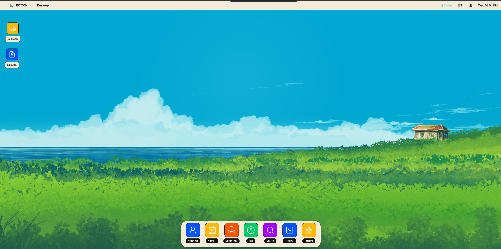
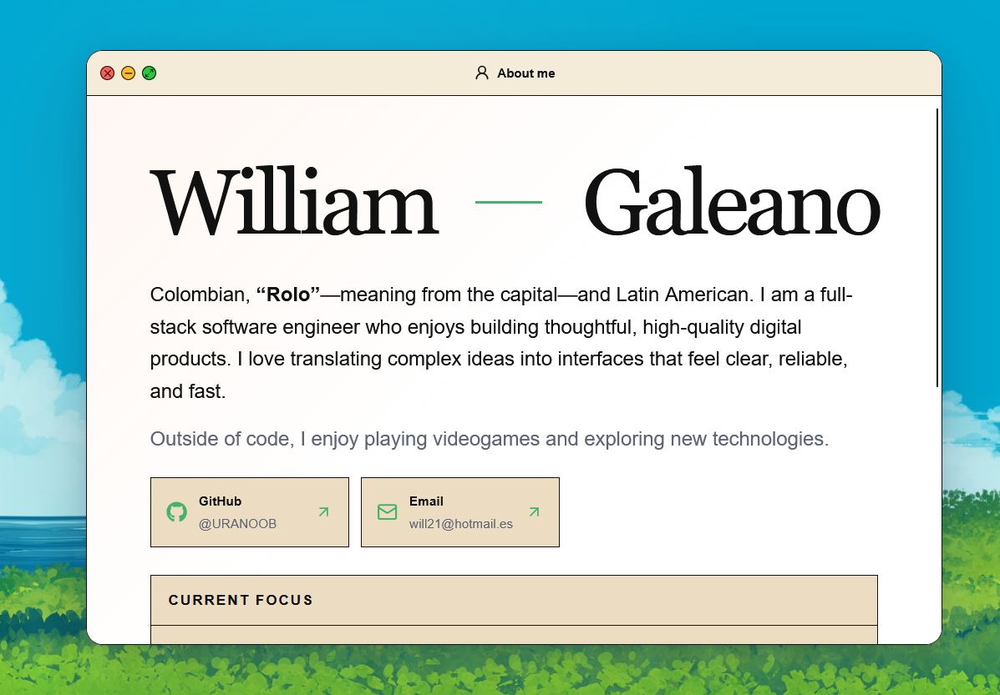
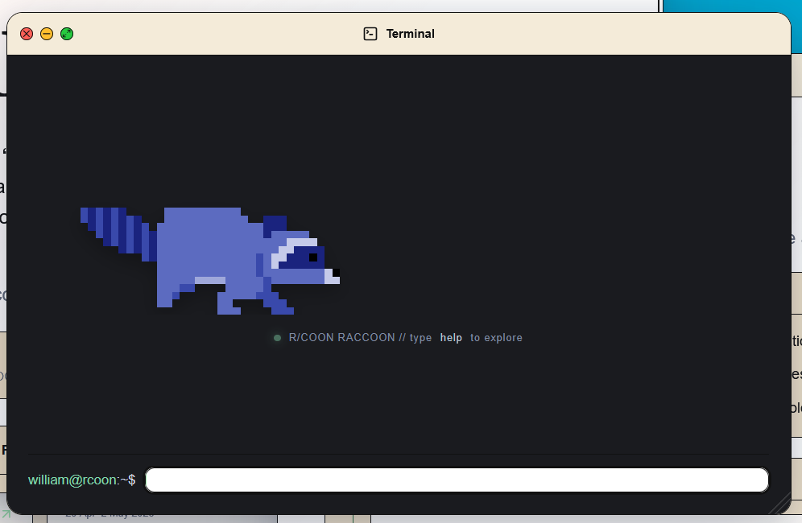

# R/COON Portfolio

Plantilla de portafolio interactivo inspirada en un escritorio de sistema operativo. Convierte secciones habituales —perfil, experiencia, proyectos, habilidades, CV y contacto— en aplicaciones dentro de una interfaz personalizable, accesible y bilingüe.

> Este repositorio incluye una licencia MIT para el código. Consulta la sección [Activos y atribución](#activos-y-atribución) antes de redistribuir imágenes, vídeos o fondos.

## Vista previa

<p align="center">
  
</p>

<p align="center">
  
  
</p>

## Características

- Escritorio responsive con barra superior, dock, accesos directos arrastrables y ventanas movibles, redimensionables, minimizables y maximizables.
- Aplicaciones para perfil, contacto, experiencia, habilidades, proyectos, logística, CV, ayuda, búsqueda, configuración y terminal.
- Contenido en español e inglés, con idioma y preferencias visuales persistentes en el navegador.
- Fondos animados y estáticos; soporte de `prefers-reduced-motion`.
- Terminal con comandos seguros para explorar el contenido y abrir enlaces.
- Rutas SEO para cada proyecto, sitemap, robots y metadatos.
- Formulario de contacto validado en cliente y servidor, listo para entrega de correo con Resend.
- Descarga y visualización de CVs.
- Navegación por teclado, estados de foco visibles y controles con etiquetas accesibles.

## Tecnologías

| Área                | Tecnologías                                                  |
| ------------------- | ------------------------------------------------------------ |
| Interfaz            | Next.js 16, React 19, TypeScript                             |
| Estado y movimiento | Zustand, Framer Motion                                       |
| Iconografía         | Lucide React, React Icons                                    |
| Estilos             | CSS global, PostCSS y Tailwind CSS                           |
| Correo              | Route Handler de Next.js + API de Resend                     |
| Despliegue          | Vercel (incluido) o entorno compatible con Vinext/Cloudflare |
| Calidad             | ESLint, Prettier y pruebas nativas de Node                   |

## Requisitos

- Node.js 22.13 o superior
- npm 10 o superior
- Una cuenta de Resend sólo si vas a habilitar el formulario de contacto

## Inicio rápido

```bash
git clone https://github.com/URANOOB/portfolio.git
cd portfolio
npm install
```

Crea el archivo de variables locales:

```bash
cp .env.example .env.local
```

En Windows PowerShell:

```powershell
Copy-Item .env.example .env.local
```

Después inicia el entorno local:

```bash
npm run dev
```

Abre `http://localhost:3000`.

## Personalizar tu portafolio

La mayor parte del contenido vive en archivos tipados dentro de `data/`. Puedes adaptar la plantilla sin tocar la estructura de las ventanas.

| Qué quieres cambiar                            | Archivo                                        |
| ---------------------------------------------- | ---------------------------------------------- |
| Nombre, biografía, enlaces sociales y contacto | `data/profile.ts`                              |
| Proyectos y enlaces externos                   | `data/projects.ts` y `data/projects-en.ts`     |
| Experiencia profesional                        | `data/experience.ts` y `data/experience-en.ts` |
| Habilidades y categorías                       | `data/skills.ts` y `data/skills-en.ts`         |
| Apps, iconos y accesos del escritorio          | `data/navigation.ts`                           |
| Comandos de la terminal                        | `lib/terminal.ts`                              |
| Ventanas abiertas inicialmente                 | `store/window-store.ts`                        |
| Tema, idioma y selección de fondo              | `store/preferences-store.ts`                   |
| Estilos, tamaños y comportamiento responsive   | `app/globals.css` y `app/bento.css`            |

### Añadir o eliminar una aplicación

1. Registra la ventana y su icono en `data/navigation.ts`.
2. Crea el componente en `components/apps/`.
3. Carga el componente desde `components/windows/AppContent.tsx`.
4. Añade estilos y, si aplica, comandos o contenido localizado.

### Cambiar CVs y recursos públicos

Los archivos públicos se sirven desde `public/`:

- CVs y previsualizaciones: `public/cv/`
- Fondo principal y capas: `public/scene/`
- Animación del terminal: `public/terminal-raccoon-walk.gif`
- Fondos seleccionables: `public/wallpapers/`

Si renombras un recurso, actualiza todas las referencias correspondientes en los componentes y datos.

## Formulario de contacto con Resend

No requiere base de datos. El flujo es:

```text
Formulario del navegador → POST /api/contact → Resend → tu bandeja de correo
```

Completa `.env.local` para desarrollo y las mismas variables en el proveedor de despliegue:

```env
NEXT_PUBLIC_SITE_URL=https://tu-dominio.com
RESEND_API_KEY=re_tu_clave
CONTACT_EMAIL=tu-buzon@ejemplo.com
CONTACT_FROM_EMAIL=Portfolio <contacto@tu-dominio-verificado.com>
```

- `RESEND_API_KEY` se usa sólo en el servidor: no debe tener prefijo `NEXT_PUBLIC_` ni subirse a Git.
- `CONTACT_EMAIL` recibe los mensajes.
- `CONTACT_FROM_EMAIL` debe usar un dominio verificado en Resend.
- El visitante queda como `reply_to`, para responderle directamente.

Para producción conviene añadir una protección anti-spam como Cloudflare Turnstile y validarla desde `app/api/contact/route.ts`.

## Desplegar en Vercel

1. Haz fork de este repositorio o impórtalo desde tu cuenta de GitHub.
2. En Vercel, selecciona **Add New → Project** e importa el repositorio.
3. Vercel detectará Next.js. Este proyecto ya incluye `vercel.json` y usa `npm run build:vercel`.
4. En **Settings → Environment Variables**, añade las cuatro variables de la sección anterior para `Production`.
5. Despliega y prueba el formulario desde la URL pública.
6. Asigna tu dominio y actualiza `NEXT_PUBLIC_SITE_URL`; después vuelve a desplegar.

Nunca guardes claves de Resend en archivos versionados. `.env.local` está ignorado por Git.

## Comandos

| Comando                | Uso                                                         |
| ---------------------- | ----------------------------------------------------------- |
| `npm run dev`          | Desarrollo local con Vinext                                 |
| `npm run build`        | Compilación para el entorno compatible con Cloudflare/Sites |
| `npm run build:vercel` | Compilación estándar de Next.js para Vercel                 |
| `npm run start`        | Ejecuta la compilación local                                |
| `npm run lint`         | Revisa el código con ESLint                                 |
| `npm run format:check` | Comprueba formato con Prettier                              |
| `npm run format`       | Aplica formato con Prettier                                 |
| `npm test`             | Compila y ejecuta las pruebas                               |

## Estructura del proyecto

```text
app/                    rutas, SEO y API de contacto
components/apps/        contenido de cada ventana
components/desktop/     escritorio, dock, barra y fondos
components/windows/     marco, capa y carga de ventanas
data/                   contenido editable y localizado
lib/                    validación y comandos de terminal
store/                  estado de ventanas y preferencias
public/                 recursos estáticos, CVs y capturas
tests/                  pruebas de lógica y renderizado
types/                  modelos TypeScript
```

## Verificación antes de publicar

```bash
npm run lint
npm run format:check
npm test
```

También prueba manualmente:

- cambio de idioma y tema;
- arrastre, minimizado y restauración de ventanas;
- enlaces sociales y de proyectos;
- descarga de CVs;
- formulario de contacto desde el dominio final.

## Activos y atribución

El código está bajo [MIT](LICENSE). Las imágenes, PDFs, GIFs, vídeos y otros recursos visuales pueden tener condiciones de uso distintas. Antes de publicar una versión derivada:

1. Usa sólo activos propios, con licencia compatible o con autorización explícita de redistribución.
2. Sustituye los fondos que procedan de servicios, juegos o talleres de terceros si no tienes permiso para redistribuirlos.
3. Conserva las atribuciones o avisos de licencia que correspondan.
4. Reemplaza los datos personales, CVs, correo y enlaces del autor por los tuyos.

## Licencia

Distribuido bajo la licencia [MIT](LICENSE).
